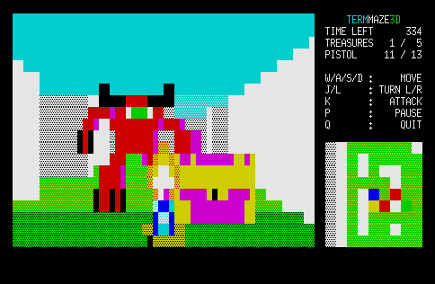

<h1 align="center">
    
</h1>


> :suspect: Pseudo-3D first-person shooter written in AWK

## Description

**TERMMAZE3D** is a first-person shooter in which the player explores a randomly generated map.
The game uses raycasting to render the walls and cellular automata to generate a map.



## Video Demo

[](https://www.youtube.com/watch?v=0FIaCN9IakM)

## Requirements

- `gawk` or `awk` (except `mawk`)
- [GNU coreutils](https://www.gnu.org/software/coreutils/) or equivalent BSD command (`dd`, `echo`, `sleep`, `stty`)

## Installation

```shell
git clone https://github.com/mikkun/termmaze3d.git
```

## How to Play

The objective of the game is to collect all the treasures before time runs out.

### Running the Game

```shell
cd /path/to/termmaze3d
./termmaze3d.awk
```

### Controls

- <kbd>w</kbd>: Move forward
- <kbd>s</kbd>: Move backward
- <kbd>a</kbd>: Strafe left
- <kbd>d</kbd>: Strafe right
- <kbd>j</kbd>: Turn left
- <kbd>l</kbd>: Turn right
- <kbd>k</kbd>: Attack
- <kbd>p</kbd>: Pause
- <kbd>q</kbd>: Quit

## License

[MIT License](./LICENSE)

## Author

[KUSANAGI Mitsuhisa](https://github.com/mikkun)

## References

- Raycasting
    - [Lode's Computer Graphics Tutorial: Raycasting](https://lodev.org/cgtutor/raycasting.html)
    - [Retro Rampage](https://github.com/nicklockwood/RetroRampage)
    - [awkaster](https://github.com/TheMozg/awk-raycaster)
- Cellular automaton
    - [Cellular Automata Method for Generating Random Cave-Like Levels](http://www.roguebasin.com/index.php?title=Cellular_Automata_Method_for_Generating_Random_Cave-Like_Levels)
    - [Procedural Level Generation in Games using a Cellular Automaton: Part 1](https://www.raywenderlich.com/2425-procedural-level-generation-in-games-using-a-cellular-automaton-part-1)
